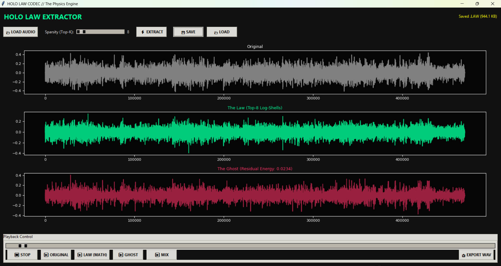

# SparseLogHarmonicCodec (HOLO-LAW)

**A Parametric Audio Codec based on Sparse Log-Harmonic Decomposition**


------------------------------------------------------------------------

## Abstract

**HOLO-LAW** is an experimental audio codec that treats sound not as a
sequence of samples, but as a sparse collection of **log-harmonic
shells**.

It operates on the hypothesis that the *structural* (intelligible)
component of audio lies on a low-dimensional manifold defined by
logarithmically spaced frequencies, while the residual signal --- **"The
Ghost"** --- represents non-linear, biological variance such as
transients, breath, and noise.

By strictly enforcing this geometric law, the codec achieves extreme
compression ratios by discarding all spectral information that does not
conform to the dominant harmonic structure.

> **Note**\
> This is an educational / research prototype.\
> The reconstructed audio is intelligible but intentionally **robotic /
> metallic** (similar to phase vocoder artifacts).\
> This is a feature, not a bug --- it demonstrates how much structure
> exists *before* texture and biology are added back.

------------------------------------------------------------------------

## How It Works

### 1. Analysis --- *The Law Extraction*

The input signal is divided into short-time frames (typically **2048
samples**) and transformed into the frequency domain.

Unlike standard codecs (MP3 / AAC), which rely on psychoacoustic
masking, HOLO-LAW applies a **hard geometric constraint**:

-   **Logarithmic Basis**\
    A fixed set of valid frequency bins spaced logarithmically to
    approximate pitch perception.

-   **Sparse Selection (Top-K)**\
    For each frame, only the **Top-K most energetic bins** are retained.

-   **Dimensionality Reduction**\
    All other frequencies are explicitly zeroed out.

------------------------------------------------------------------------

### 2. The `.law` Data Format

Instead of storing PCM samples, the codec stores a sparse list of
**atomic parameters** per frame:

  Parameter   Type      Description
  ----------- --------- ------------------------
  Index       uint8     Log-harmonic bin index
  Magnitude   float16   Spectral magnitude
  Phase       float16   Spectral phase

This reduces bitrate from approximately **\~705 kbps** (16-bit mono WAV
@ 44.1 kHz) to **\~15 kbps**, yielding compression ratios of
**20×--50×**.

------------------------------------------------------------------------

### 3. The Ghost (Residual)

The signal is explicitly separated into:

-   **The Law** --- deterministic harmonic structure\
-   **The Ghost** --- residual non-linear error

This exposes the boundary between **linear physics** and **biological
texture** in sound.

------------------------------------------------------------------------

## Features

-   Tkinter-based interactive GUI
-   Layered auditioning (Original / Law / Ghost)
-   Variable sparsity control
-   Timeline scrubbing
-   WAV export

------------------------------------------------------------------------

## Usage

### Requirements

-   Python 3.8+
-   numpy, scipy, soundfile, sounddevice, matplotlib

``` bash
pip install numpy scipy soundfile sounddevice matplotlib
```

### Running

``` bash
python holo_law_codec.py
```

------------------------------------------------------------------------

## Prior Art & Context

-   McAulay & Quatieri (1986): Sinusoidal speech modeling
-   Sparse FFT
-   Codec 2

------------------------------------------------------------------------

## License

MIT License

------------------------------------------------------------------------

> This project is not about replacing MP3.\
> It is about understanding where compression comes from.
